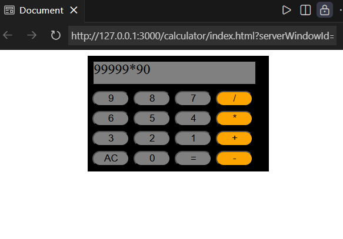

# Calculator Web Application

## 📌 Project Description
This is a simple calculator web application built using HTML, CSS, and JavaScript.  
The calculator performs basic arithmetic operations such as addition, subtraction, multiplication, and division.

This project was created as a practice project while learning front-end web development.  
It helps in understanding how HTML structures the page, CSS styles the interface, and JavaScript handles the calculator logic.

---

## 🚀 Features
- Perform basic arithmetic operations (+, −, ×, ÷)
- Simple and clean user interface
- Interactive buttons
- Clear display functionality
- Instant calculation results

---

## 🛠 Technologies Used
- HTML5
- CSS3
- JavaScript

---
## 📷 Project Screenshot

